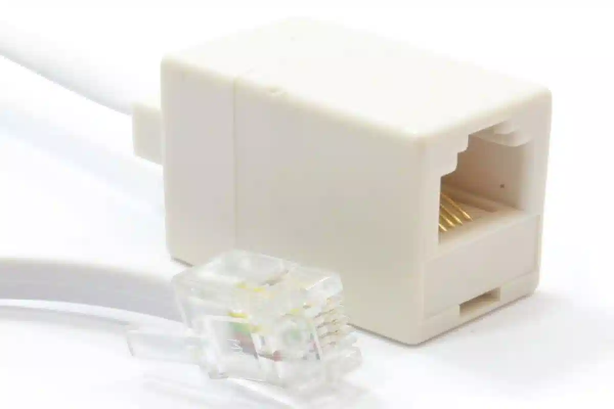
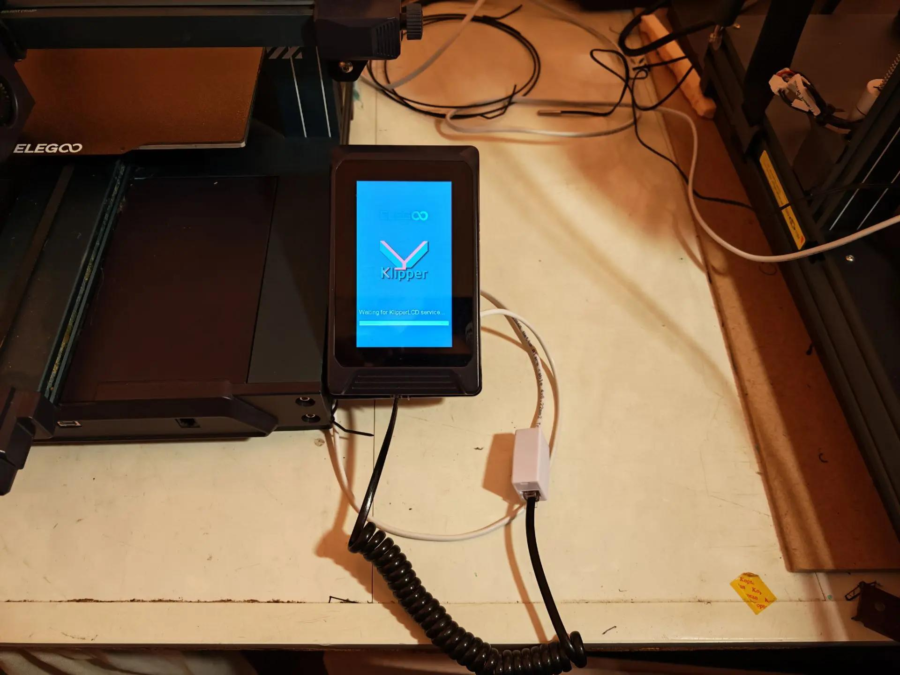

# KlipperLCD (Адаптация экрана принтера Elegoo Neptune 3 Pro)

([English version](README.md))

Хотите запустить Klipper на своем Neptune 3 Pro? И все еще хотите использовать сенсорный ЖК-экран Neptune 3 Pro?

[joakimtoe](https://github.com/joakimtoe/KlipperLCD)  
а позже  
[yayuuu](https://github.com/yayuuu/KlipperLCD)

Предлагают сервис на python для ЖК-дисплея Elegoo Neptune 3 Pro! Работает совместно с Klipper3d и Moonraker!

## Как это выглядит

<p float="left">
    
    
    
</p>

## Что для этого нужно?
* Elegoo Neptune 3 Pro с "родным" ЖК-экраном.
* Raspberry Pi или схожий одноплатник, для запуска Klipper. Рекомендуют использовать [Klipper Installation And Update Helper (KIAUH)](https://github.com/dw-0/kiauh) для настройки и установки Klipper, Moonraker и web интерфейса по выбору ([Fluidd](https://docs.fluidd.xyz/)/[Mainsail](https://docs.mainsail.xyz/)).
* Авторы предлагают немного переделайть ЖК-экран, чтобы подключить его к одному из интерфейсов UART, доступных на вашем Raspberry Pi / SBC, или через конвертер USB в UART.
* Вместо этого, я поставил переходник `6р4с/RJ11` (гнездо в гнездо) и добавил провод, который уже подключил к USB->UART
*  Двлее следовать этому руководству, чтобы включить сенсорный экран Neptune 3 Pro!

## Подключаем LCD (вариант от авторов)
При подключении экрана вы можете либо подключить его напрямую к одному из доступных интерфейсов Raspberry Pi / SBC, либо подключить его через конвертер USB в UART. Оба варианта описаны ниже, выберите тот, который соответствует вашим потребностям.

### К Raspberry Pi UART
1. Снимите заднюю крышку ЖК-дисплея, открутив четыре винта.

2. Подключите ЖК-дисплей к интерфейсу Raspberry Pi UART в соответствии с приведенной ниже таблицей:

    | Raspberry Pi  | LCD               |
    | ------------- | ----------------- |
    | Pin 4 (5V)    | 5V  (Black wire)  |
    | Pin 6 (GND)   | GND (Red wire)    |
    | GPIO 14 (TXD) | RX  (Green wire)  |
    | GPIO 15 (RXD) | TX (Yellow wire)  |

    <p float="left">
        
        
    </p>

### Через USB->UART Адаптер
Quite simple, just remember to cross RX and TX on the LCD and the USB/UART HW.
| USB <-> UART HW | LCD               |
| --------------- | ----------------- |
| 5V              | 5V  (Black wire)  |
| GND             | GND (Red wire)    |
| TXD             | RX  (Green wire)  |
| RXD             | TX (Yellow wire)  |


<p float="left">
    
    
</p>

### Можно, вместо прямого подключения к экрану, использовать переходник `6р4с RJ11` и дополнительный провод с RJ11

<p float="left">
  
</p>


Провод от экрана подключаем в переходник. Дополнительный провод с одной стороны втыкаем в ответную часть переходника, а с другой отрезаем разъем и зачищаем 4-е провода, и подключаем согласно рисункам выше. Имейте ввиду, не смотрите на цвета своих проводов,смотрите на то чтобы ваш конец провода приходил на нужный контакт экрана и одноплатика/адаптера USB->UART. Потому что на живом железе цвета могут отличаться, да еще переходник может вносить путаницу. Просто смотрите чтобы 
```
5v->5v, 
Gnd->Gnd, 
RxD->TxD, 
TxD->RxD
```

<p float="left">
  
</p>


## Обновление встроенного ПО ЖК-экрана
1. Скопируйте файл прошивки ЖК-экрана `LCD/20240125.tft` в корневую папку карты micro-SD, отформатированной в FAT32.
2. Убедитесь, что питание ЖК-экрана выключено.
3. Вставьте карту micro-SD в порт SD-карт экрана. Необходимо снять заднюю крышку.
4. Включите ЖК-дисплей и дождитесь, пока на экране появится надпись `Update Successed!`.

Более подробное руководство по обновлению встроенного программного обеспечения ЖК-экрана можно найти на сайте [Elegoo web-pages](https://www.elegoo.com/blogs/3d-printing/elegoo-neptune-3-pro-plus-max-fdm-3d-printer-support-files).


## Включаем основной UART
> **_Примечание_**: Вы можете спокойно пропустить этот раздел, если подключали дисплей через преобразователь USB в UART  
> **_Примечание 2_**: Это касается только одноплатников Raspberry Pi, для компьютеров других производителей, обратитесь к их мануалам.

### [Отключаем Linux serial console](https://www.raspberrypi.org/documentation/configuration/uart.md)
  By default, the primary UART is assigned to the Linux console. If you wish to use the primary UART for other purposes, you must reconfigure Raspberry Pi OS. This can be done by using raspi-config:

По умолчанию основной UART назначен консоли Linux. Если вы хотите использовать основной UART для других целей, вам необходимо перенастроить Raspberry Pi OS. Это можно сделать с помощью raspi-config:

  * Запустите raspi-config: `sudo raspi-config.`
  * Выберите опцию 3 - Параметры интерфейса.
  * Выберите опцию P6 - Последовательный порт.
  * В ответ на запрос Хотите ли вы, чтобы командная строка входа была доступна через последовательный порт (Would you like a login shell to be accessible over serial)? ответьте "Нет"
  * В ответ на запрос, хотите ли вы, чтобы аппаратный последовательный порт был включен (Would you like the serial port hardware to be enabled)? ответьте "Да"
  * Выйдите из raspi-config и перезагрузите Pi, чтобы изменения вступили в силу.
  
  Подробные инструкции по использованию оверлеев дерева устройств (Device Tree overlays) приведены  [на сайте разработчика](https://www.raspberrypi.org/documentation/configuration/device-tree.md). 
  
  Если не вдаваться в подробности, добавьте следующую строку в файл `/boot/config.txt`, чтобы применить наложение дерева устройств.
    
    dtoverlay=disable-bt

## Запуск сервиса KlipperLCD 
* Подключитесь по SSH к вашеиму Raspberry Pi

### Klipper socket API
* Убедитесь, что  Klipper socket API включен, прочитав аргументы Klipper.

    Команда:

        cat ~/printer_data/systemd/klipper.env

    Ответ:

        KLIPPER_ARGS="/home/pi/klipper/klippy/klippy.py /home/pi/printer_data/config/printer.cfg -I /home/pi/printer_data/comms/klippy.serial -l /home/pi/printer_data/logs/klippy.log -a /home/pi/printer_data/comms/klippy.sock"
    
    В KLIPPER_ARGS должно быть добавлено `-a /home/pi/printer_data/comms/klippy.sock`. Если это не так, доавьте это в файл klipper.env!

### Установим зависимости

В оригинальной инструкции было так:  

    sudo apt-get install python3-pip git
    pip install pyserial

В последних версиях Raspberry OS общие библиотеки python надо ставить через apt:  
    
    sudo apt-get install python3-pip git
    apt install python3-serial

### Получаем код с Get

В оригинале предлагалось брать код из первоначального репозитория, но `joakimtoe` давно не поддерживает проект (ну по крайней мере на момент написания этой инструкции). Поэтому 
предлагаю скачать код с репозитория `yayuuu`

    git clone https://github.com/yayuuu/KlipperLCD.git
    cd KlipperLCD

(оригинальный вариант, для истории):

    git clone https://github.com/joakimtoe/KlipperLCD
    cd KlipperLCD

### Настройка кода
* Откройте `main.py` и найдите попределение `class KlipperLCD`:

```python
class KlipperLCD ():
    def __init__(self):
        ...
        LCD("/dev/ttyAMA0", callback=self.lcd_callback)
        self.lcd.start()
        self.printer = PrinterData('XXXXXX', URL=("127.0.0.1"), callback=self.printer_callback)        
        ...
```
* Если ваш UART отличается от `ttyAMA0` по умолчанию, замените строку `"/dev/ttyAMA0"`, чтобы она соответствовала выбранному вами UART.

* Если для подключения вашего экрана к Klipper используется конвертер USB в UART, он обычно отображается в Linux как `"/dev/ttyUSB0"` можно использовать этот псевдоним. Но рекомендуют получить точное имя и использовать его:

    Запрос:

        ls /dev/serial/by-id

    Ответ (будет что-то вроде этого, зависит от адаптера):

        usb-1a86_USB2.0-Ser_-if00-port0

    И тогда подставляем такую строку (запрошенный путь + ответ) `"/dev/serial/by-id/usb-1a86_USB2.0-Ser_-if00-port0"`

* По-идее запросы к Moonracker изнутри должны работать без API-key, но для этого надо будет кое-что исправить в коде. Поэтому просто получим ключ и пропишем его вместо `"XXXXXX"` в коде приведенном выше:

    Команда:

        ~/moonraker/scripts/fetch-apikey.sh

    Вернет API-Key. Подставим его в код инициализации PrinterData()  (см. код python выше)
         

### Сделаем пробный запуск
Как только сенсорный ЖК-экран будет подключен к Raspberry Pi, Klipper socket API будет включен, а класс KlipperLCD настроен в соответствии с вашими настройками, вы можете запустить код!

    python3 main.py

> **_Примечание_**: (На самом деле, на последних версиях Raspberry OS, можно писать просто `python`, вместо `python3`)

Поздравляем! Теперь вы можете пользоваться сенсорным экраном! (Ну, по крайней мере пока запущен скрипт. Остановка по Ctr+C)

### Запуск KlipperLCD сервиса при загрузке

Если путь к `main.py` отличается от `/home/pi/KlipperLCD/main.py` или ваш пользователь не `pi`. Откройте и отредактируйте `KlipperLCD.service` так чтобы он удовлетворял вашим условиям.

Включим автоматический запуск службы при загрузке:

    sudo chmod +x main.py

    sudo chmod +x KlipperLCD.service

    sudo cp KlipperLCD.service /etc/systemd/system/KlipperLCD.service

    sudo chmod 644 /etc/systemd/system/KlipperLCD.service

    sudo systemctl daemon-reload

    sudo systemctl enable KlipperLCD.service

    sudo reboot

> **_Примечание_**: В оригинале, в третьей команде было `mv` вместо `cp`.  На работе сервиса это не сказывается, просто (в моём варианте) копия файла остается в исходной папке.

## Консоль
Консоль включена по умолчанию, и доступ к ней можно получить, щелкнув по центру в верхней части главного экрана или по области миниатюр во время печати.

Консоль позволяет отправлять команды и отображать все ответы gcode и информацию из Klipper, которые обычно находятся на вкладке консоли в Mainsail или Fluidd.

<p float="left">
    
    
    
</p>

## Миниатюры (Thumbnails)
KlipperLCD также поддерживает миниатюры!

Следуйте этому руководству, чтобы включить миниатюры в вашем слайсе: https://klipperscreen.readthedocs.io/en/latest/Thumbnails/

<p float="left">
    
    
</p>
